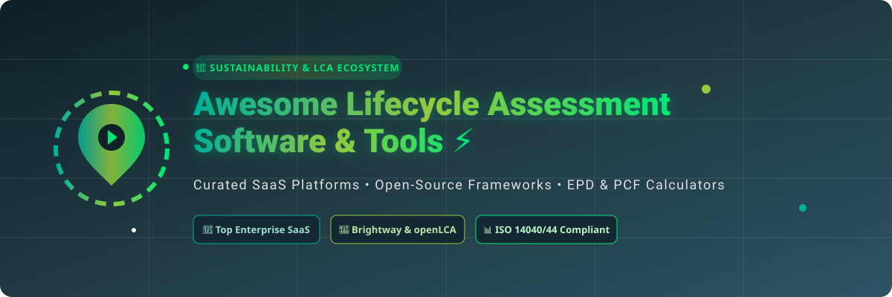

  

  
  
  
  
  
  
  

---

# 🌿 Awesome Lifecycle Assessment (LCA) Software Ecosystem 🚀

> **A curated, search-engine-optimized list of enterprise SaaS platforms, open-source python frameworks, EPD tools, and ISO 14040/44 compliant environmental footprint engines.**

Welcome to the definitive directory for **Life Cycle Assessment (LCA)**, **Product Carbon Footprint (PCF)**, **Environmental Product Declarations (EPD)**, and **Scope 3 Decarbonization Software**. Whether you are an industrial sustainability consultant, academic researcher, ESG analyst, or product designer, this repository indexes top commercial and open-source solutions for modeling environmental impacts across raw material extraction, manufacturing, use, and end-of-life stages.

---

## 📌 Table of Contents

- [📊 Sector Market Overview](#-sector-market-overview)
- [🏢 SaaS & Enterprise Platforms](#-saas--enterprise-platforms)
- [💻 Open-Source GitHub Projects](#-open-source-github-projects)
- [💡 Choosing the Right LCA Tool](#-choosing-the-right-lca-tool)
- [🤝 How to Contribute](#-how-to-contribute)
- [☕ Support & Sponsorship](#-support--sponsorship)
- [📈 Star History](#-star-history)
- [⚠️ Disclaimer](#%EF%B8%8F-disclaimer)

---

## 📊 Sector Market Overview

The **Global Life Cycle Assessment (LCA) & Environmental Footprint Software Market** is estimated at **~$1.3 Billion to $1.5 Billion (2026)** and is projected to reach **~$3.8 Billion by 2032** growing at a CAGR of **~14.5%**, driven by mandatory European Scope 3 / CSRD regulations, CBAM carbon taxes, and building EPD mandates (EN 15978).

> 🧭 **Market Dynamics:** The sector is **moderately fragmented**. Heavyweight legacy incumbents (*Sphera/GaBi*, *SimaPro*) control deep industrial database market share, while vertical leaders (*One Click LCA* in green construction) and modern API-first Scope 3 supply chain startups (*Ecochain*, *CarbonGraph*, *Earthster*) rapidly capture new enterprise design teams.

---

## 🏢 SaaS & Enterprise Platforms

Below is a detailed benchmark of leading commercial LCA SaaS platforms, sorted by **Estimated Company Size / Valuation (Descending)**:

| SaaS Product 🌐 | Description 📝 | Est. Company Size (Rev / Valuation) 💰 | Starting Tier Price 🏷️ | Free Tier / Trial Limits 🎁 |
| :--- | :--- | :--- | :--- | :--- |
| **[GaBi / Sphera LCA](https://sphera.com/)** | Enterprise-grade LCA & supply chain sustainability engine backed by extensive managed industrial databases. | ~$1.4B Valuation (~$250M Rev) | **$5,000 / year** (Enterprise seat base tier) | **30-day trial**: Corporate evaluation upon sales request & demo approval. |
| **[One Click LCA](https://www.oneclicklca.com/)** | Automated construction & building sector LCA platform for EN 15978, LEED, BREEAM, and EPD compliance. | ~$150M Valuation (~$30M Rev) | **€990 / year** (Starter tier for single users) | **14-day trial**: Free trial with sample building templates & basic material datasets. |
| **[SimaPro](https://simapro.com/)** | Gold-standard professional LCA software used globally for ISO 14040/44 compliant studies, EPDs, and complex modeling. | ~$30M Revenue | **€2,500 / year** (SimaPro Power SaaS edition) | **30-day trial**: Educational evaluation license with restricted database exports. |
| **[Umberto LCA+](https://www.ifu.com/umberto/)** | High-precision material flow cost accounting (MFCA) and process impact visualization software by ifu Hamburg/iPoint. | ~$25M Revenue (iPoint Group) | **€2,200 / year** (Professional single-user tier) | **14-day trial**: Free trial limited to max 20 process nodes with export disabled. |
| **[Ecochain](https://ecochain.com/)** | Activity-based and product-level environmental footprint software (Ecochain Mobius & Helix) for manufacturing teams. | ~$8M Revenue | **€3,600 / year** (Ecochain Mobius starter tier) | **14-day trial**: Mobius sandbox account for 1 user and up to 2 product footprint models. |
| **[Sustainable Minds](https://www.sustainableminds.com/)** | Cloud eco-design and LCA software empowering product engineering teams to evaluate impact early in R&D. | ~$5M Revenue | **$1,400 / year** (Professional/Educational subscription) | **15-day trial**: Free 1-user account with watermarked PDF reports. |
| **[CarbonGraph](https://carbongraph.io/)** | Modern API-first product carbon footprint (PCF) calculation and automated supply chain impact tracing platform. | ~$2M Revenue | **$1,200 / year** ($100/mo billed annually) | **Free Forever Plan**: 1 user seat, up to 3 active product supply chain models. |
| **[Earthster](https://www.earthster.org/)** | Real-time collaborative LCA platform enabling instant environmental impact visibility across entire product cycles. | ~$1.5M Revenue | **€990 / year** (Pro tier for unlimited model publishing) | **Free Forever Tier**: Unlimited viewing & collaboration, up to 1 published product LCA. |

---

## 💻 Open-Source GitHub Projects

The LCA ecosystem features rich open-source libraries, Python engines, and desktop applications. Repositories below are **sorted by GitHub Star Count (Descending)**:

| Repository 📦 | Description 📜 | Stars ⭐ |
| :--- | :--- | :--- |
| **[Activity-Browser](https://github.com/Activity-Browser/activitybrowser)** | Open-source graphical user interface (GUI) for the Brightway2 LCA framework, enabling intuitive process modeling and matrix calculations. |  |
| **[Brightway2 Framework](https://github.com/brightway-lca/brightway2)** | Leading modular Python framework for life cycle assessment, optimized for high-performance matrix calculations and large LCI databases. |  |
| **[openLCA Desktop App](https://github.com/GreenDelta/olca-app)** | Full-featured, modular open-source desktop application for modeling life cycle systems, calculating impact categories, and working with ecoinvent/ILCD data. |  |
| **[Premise Prospective LCA](https://github.com/polca-lca/premise)** | Open-source Python package for integrating prospective energy & climate scenario models (IAMs) into background LCA databases. |  |
| **[bw2data](https://github.com/brightway-lca/bw2data)** | Core data management and inventory storage layer for the Brightway2 LCA calculation engine. |  |
| **[olca-ipc.py Client](https://github.com/GreenDelta/olca-ipc.py)** | Python inter-process communication (IPC) client for automating openLCA, running scripts, and interfacing external software. |  |
| **[BONSAI Open Database](https://github.com/BONSAMURAIS/bonsai)** | Open-source data architecture and algorithms for creating an independent, transparent global LCI database. |  |
| **[olca-schema](https://github.com/GreenDelta/olca-schema)** | Data format schema definitions (JSON-LD) for openLCA data exchange, data providers, and system boundary definitions. |  |
| **[bw2calc Engine](https://github.com/brightway-lca/bw2calc)** | Fast matrix calculation engine powered by SciPy and NumPy for solving life cycle inventory supply systems. |  |
| **[bw_timex Extension](https://github.com/brightway-lca/bw_timex)** | Time-explicit LCA engine for Brightway, matching background process inventories to specific temporal timestamps. |  |
| **[brightway2-io Parsers](https://github.com/brightway-lca/brightway2-io)** | Input and output data parsers for SimaPro CSV, Ecospold 1/2, Excel, and Simapro inventory files into Brightway2. |  |

---

## 💡 Choosing the Right LCA Tool

- 🔬 **For Academic Research & Python Data Science**: Use **Brightway2** paired with **Activity-Browser** or **Premise** for dynamic scenario modeling, uncertainty analysis, and custom LCIA methods.
- 🏢 **For ISO 14040/44 Compliance & Commercial EPDs**: Choose **SimaPro** or **Sphera LCA** for out-of-the-box verified background databases (ecoinvent, GaBi databases) and auditor recognition.
- 🏗️ **For Architecture, Engineering & Construction (AEC)**: Utilize **One Click LCA** for seamless BIM integration (Revit, IFC) and building standard calculations (EN 15978 / LEED).
- ⚡ **For Modern Product Design & Agile Startups**: Adopt **Earthster** or **CarbonGraph** for rapid collaborative modeling and intuitive carbon footprint tracking.

---

## 🤝 How to Contribute

Contributions are welcome! Please follow these simple guidelines:

1. Fork this repository 🍴.
2. Add your entry to `README.md` in alphabetical or star-sorted order 📝.
3. Follow the formatting standard (include product/repo name, official link, factual 1-2 sentence description, and pricing/Stars_Badge info).
4. For awesome lists inspiration, check out [Awesome Lists](https://github.com/ishandutta2007/Awesome-Awesome-Awesome).
5. Open a Pull Request (PR) with a clear title and description 🚀.

---

## ☕ Support & Sponsorship

If you find this list helpful for your sustainability research, enterprise evaluation, or open-source projects, please consider supporting the project:

- ⭐ **Star this repository** to help others discover it on GitHub!
- 🔀 **Fork & Share** with your colleagues, LCA consultants, and research peers.
- 💖 **Sponsor the Maintainer**: Buy us a coffee or sponsor ongoing maintenance on GitHub Sponsors:

  

Thank you for helping make environmental impact modeling more transparent, reproducible, and accessible for everyone! 🌍💚

---

## 📈 Star History

---

## ⚠️ Disclaimer

- This repository is a **community-curated directory** provided for educational and informational purposes only.
- Product pricing and free trial details are gathered from public vendor documentation as of September 2026 and are subject to change.
- Life cycle assessment calculations depend heavily on methodological boundary choices, data allocation rules, and database quality. Inclusion in this list does not constitute formal certification or commercial endorsement.
